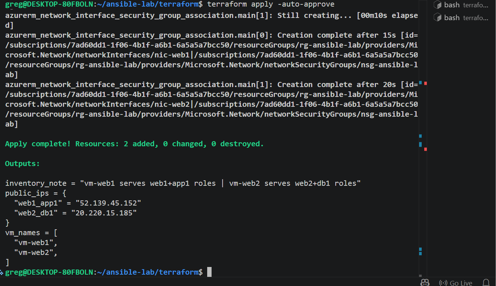
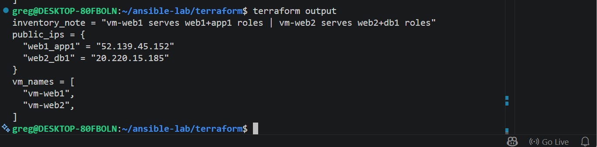
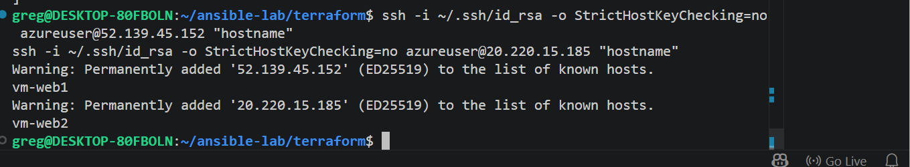
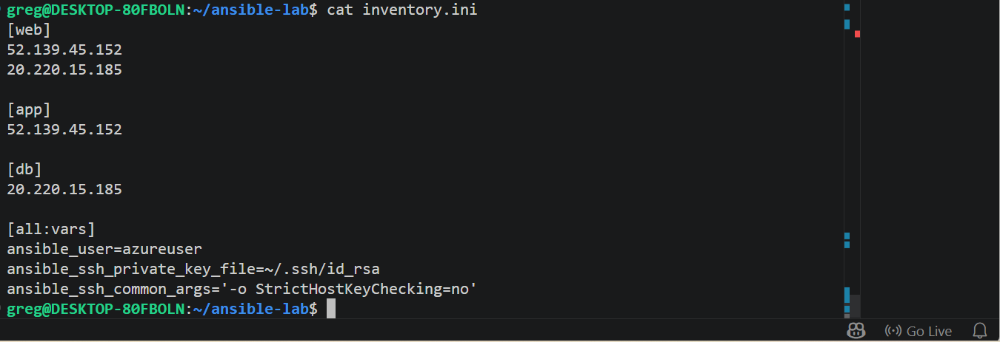
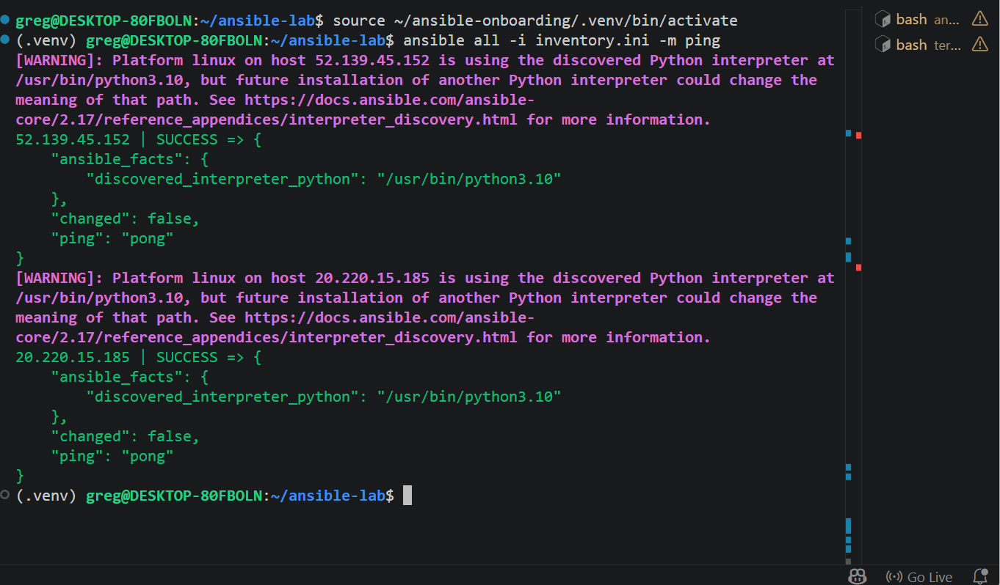
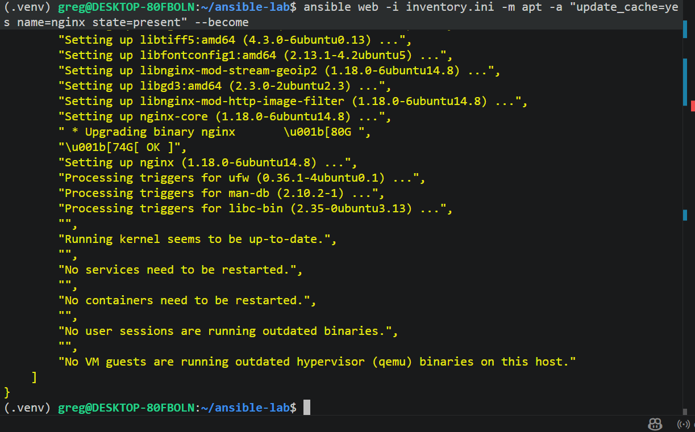
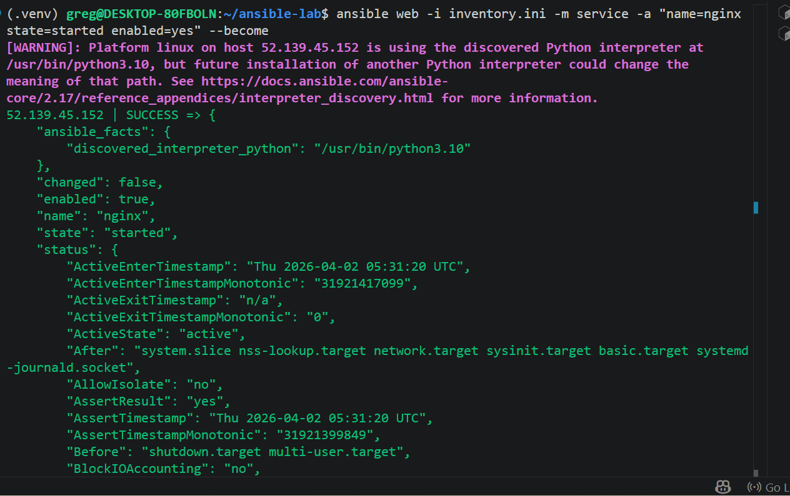
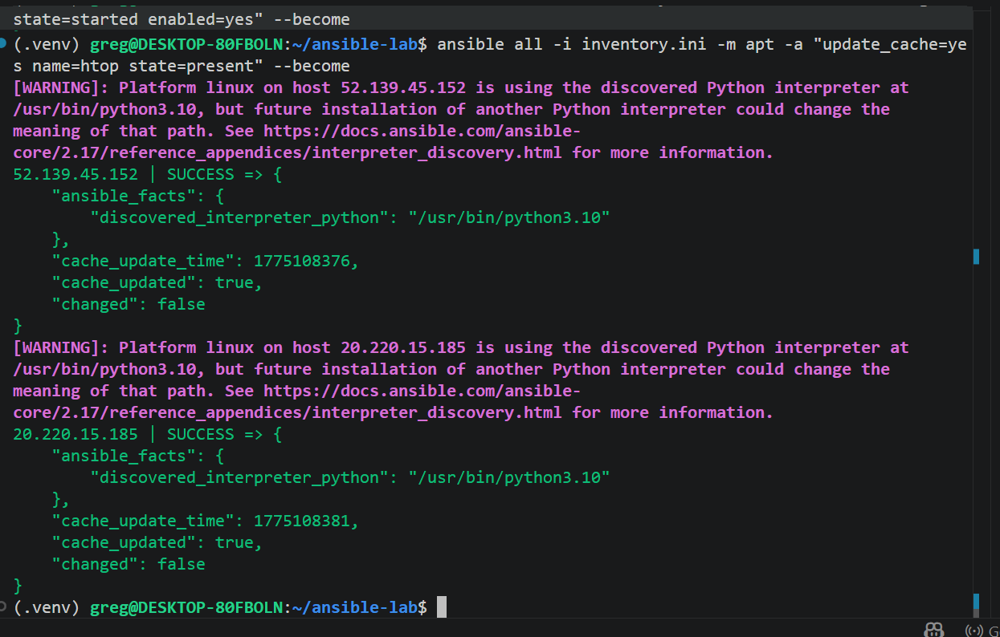
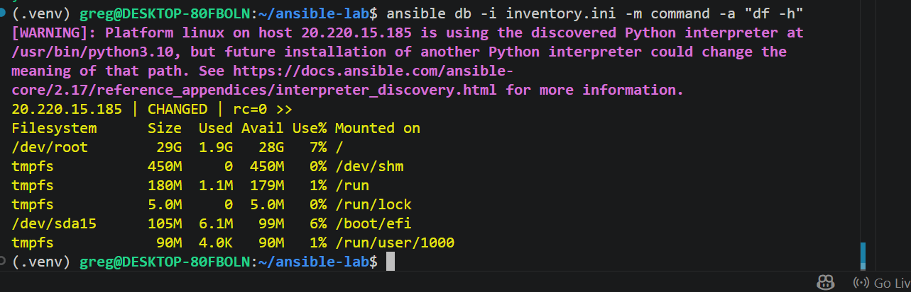
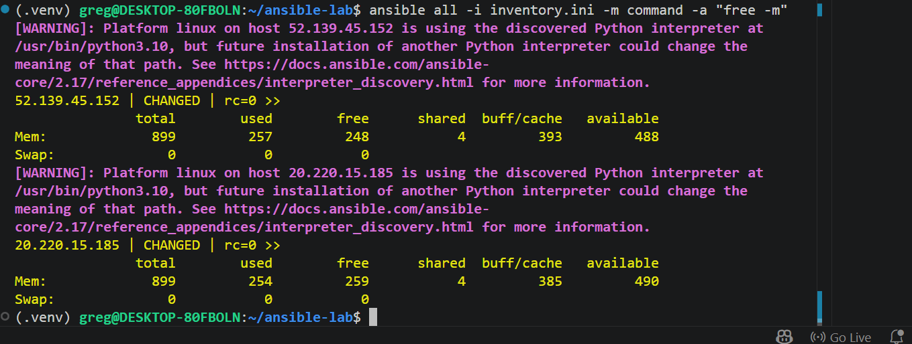

# ansible-lab
> Ad-Hoc Automation on Azure — 4 VMs, Inventory & Passwordless SSH — IBT DevOps Assignment 2


---

## Overview

This repository provisions Azure Linux VMs using Terraform, configures passwordless SSH, builds a custom Ansible inventory, and runs ad-hoc commands across hosts and groups.

**Architecture:**
```
WSL2 Control Node (local)
    |
    |-- Ansible ad-hoc commands over SSH
    |
    |-- vm-web1 (52.139.45.152) -- web1 + app1 roles
    |-- vm-web2 (20.220.15.185) -- web2 + db1 roles
```

---

## System Details

| Component | Details |
|---|---|
| Control Node | WSL2 Ubuntu 22.04 LTS |
| Azure Region | canadacentral |
| VM Size | Standard_B2ats_v2 (2 vCPUs, 1 GiB RAM — free eligible) |
| OS Image | Ubuntu 22.04 LTS |
| Terraform | v1.14.6 |
| Ansible | core 2.17.14 |
| SSH Key | ~/.ssh/id_rsa (existing RSA key) |

---

## Free Tier Architecture Note

> The assignment requires 4 separate VMs. The Azure free subscription enforces a **4 vCPU regional quota** in canadacentral. Since `Standard_B2ats_v2` uses 2 vCPUs, only 2 VMs can run simultaneously. Solution: **2 physical VMs serve 4 logical roles** in the Ansible inventory — a common real-world pattern for dev/sandbox environments.

| Physical VM | Public IP | Logical Roles |
|---|---|---|
| vm-web1 | 52.139.45.152 | web1 (web group) + app1 (app group) |
| vm-web2 | 20.220.15.185 | web2 (web group) + db1 (db group) |

---

## Screenshots

### Terraform Apply Output


### Terraform Output — Public IPs


### Passwordless SSH Verification


### inventory.ini


### ansible ping — All Hosts SUCCESS


### nginx Install on Web Group


### nginx Service Started


### htop Install All Hosts


### df -h DB Group


### free -m All Hosts


---

## Project Structure

```
ansible-lab/
├── terraform/
│   ├── main.tf              # Provider, RG, VNet, Subnet, NSG, PIPs, NICs, VMs
│   ├── variables.tf         # vm_roles variable
│   ├── outputs.tf           # public_ips, vm_names, inventory_note
│   └── .terraform.lock.hcl  # Provider version lock
├── inventory.ini            # Ansible inventory — 4 logical groups, 2 physical VMs
└── README.md
```

---

## Terraform Quick Start

```bash
cd ~/ansible-lab/terraform

# Authenticate Azure CLI
az login --use-device-code --tenant 393a8838-12b0-4787-b70f-28b6b4d0a146
az account set --subscription "7ad60dd1-1f06-4b1f-a6b1-6a5a5a7bcc50"

# Initialize and deploy
terraform init
terraform plan
terraform apply -auto-approve

# Get public IPs
terraform output
```

---

## Ansible Inventory

```ini
[web]
52.139.45.152    # vm-web1 (also serves app1 role)
20.220.15.185    # vm-web2 (also serves db1 role)

[app]
52.139.45.152    # vm-web1 acting as app1

[db]
20.220.15.185    # vm-web2 acting as db1

[all:vars]
ansible_user=azureuser
ansible_ssh_private_key_file=~/.ssh/id_rsa
ansible_ssh_common_args='-o StrictHostKeyChecking=no'
```

---

## Ad-Hoc Commands Reference

```bash
# Activate venv first
source ~/ansible-onboarding/.venv/bin/activate

# Test connectivity
ansible all -i inventory.ini -m ping

# Identity check
ansible all -i inventory.ini -m command -a "whoami"

# Uptime
ansible all -i inventory.ini -m command -a "uptime"

# Install nginx on web group
ansible web -i inventory.ini -m apt -a "update_cache=yes name=nginx state=present" --become

# Start and enable nginx
ansible web -i inventory.ini -m service -a "name=nginx state=started enabled=yes" --become

# Install htop on all hosts
ansible all -i inventory.ini -m apt -a "update_cache=yes name=htop state=present" --become

# Disk usage — db group only
ansible db -i inventory.ini -m command -a "df -h"

# Memory check — all hosts
ansible all -i inventory.ini -m command -a "free -m"
```

---

## Key Challenges & Solutions

| Challenge | Solution |
|---|---|
| Old ARM_* env vars overriding Terraform auth | `unset ARM_CLIENT_ID ARM_CLIENT_SECRET ARM_TENANT_ID ARM_SUBSCRIPTION_ID` + removed from `~/.bashrc` |
| Wrong tenant cached in Terraform | Added `tenant_id` and `subscription_id` explicitly to provider block |
| Provider registration timeout on fresh subscription | Added `skip_provider_registration = true` |
| Basic SKU public IPs not available on free tier | Switched to `Standard` SKU for public IPs |
| Max 3 public IPs in canadacentral | Used 2 VMs with 4 logical roles — fits within quota |
| Standard_B1s not available in canadacentral | Used `Standard_B2ats_v2` — only free-eligible size |
| nginx install failed — libtiff5 404 | Added `update_cache=yes` to refresh stale apt cache |
| NSG already existed from partial run | Used `terraform import` to bring into state |

---

## Cleanup

```bash
# Destroy all Azure resources
cd ~/ansible-lab/terraform
terraform destroy -auto-approve

# Verify resource group deleted
az group show --name rg-ansible-lab --query "properties.provisioningState" -o tsv
```

---

## Ad-Hoc vs Playbook — When to Use Which

| Ad-Hoc | Playbook |
|---|---|
| Quick one-time tasks | Repeatable complex deployments |
| Troubleshooting & verification | Production configurations |
| Package install during setup | Role-based multi-step automation |
| No repeatability needed | Requires idempotency & version control |

---

## Author

**gregodprogrammer** — IBT Certified DevOps Engineer | Agentic AI Builder | Founder HOCS Nigeria

- GitHub: [@gregodprogrammer](https://github.com/gregodprogrammer)
- LinkedIn: [linkedin.com/in/gregodi](https://linkedin.com/in/gregodi)

---

## DMI Micro-Internship

This project was completed as part of the **DevOps Micro-Internship (DMI) Cohort-2** program.

| Detail | Info |
|---|---|
| Program | DevOps Micro-Internship (DMI) Cohort-2 |
| Assignment | Assignment 2 — Ad-Hoc Automation on Azure: 4 VMs, Inventory & Passwordless SSH |
| Candidate | Greg Odi |
| GitHub | [@gregodprogrammer](https://github.com/gregodprogrammer) |
| LinkedIn | [linkedin.com/in/gregodi](https://linkedin.com/in/gregodi) |
